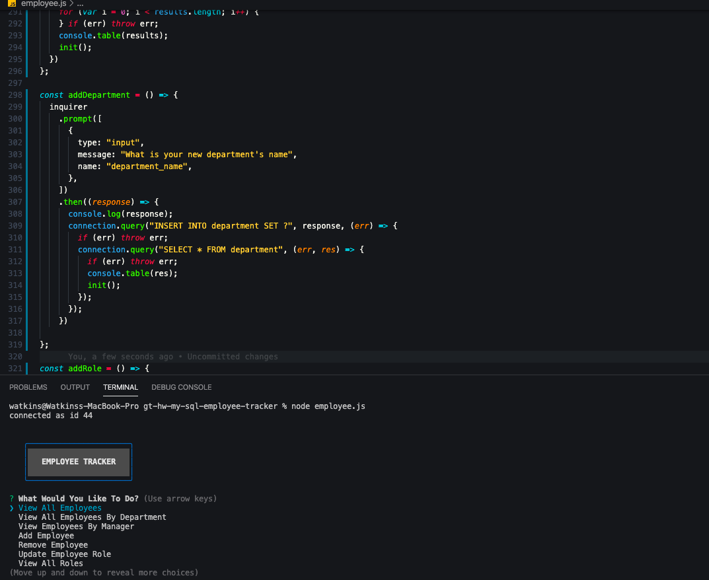
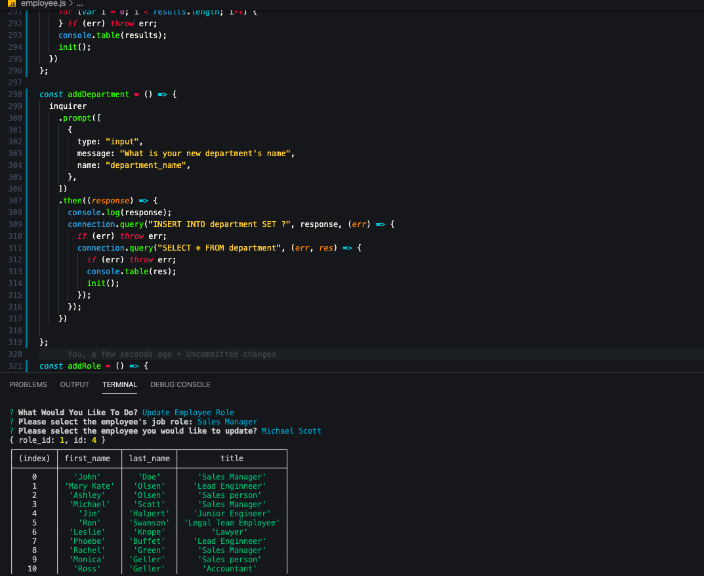

# gt-hw-my-sql-employee-tracker
## Description 

This is a homework requirement for GT Full Stack Flex Program. This mySQL webpage is designed to create an employee database that combines three different tables to be manipulated and changed by the user for the specific needs of a company. You can assign an employee to a different department, get information about specific data within your company, add different aspects to the company and delete employee information. 

## Table of Contents

* [Installation](#installation)
* [Usage](#usage)
* [Credits](#credits)
* [MIT License](#mit_license)
* [Badges](#badges)
* [Contributing](#contributing)
* [Tests](#tests)

## Installation

* Copy EmployeeSchema.sql in your local mySQL workbench and query the database
* In the github repo link, clone the repo and install on your local VS code
* Run npm install from package.json
* Run node employee.js and follow the prompts

[Link to Github Repo](https://crystalwatkins.github.io/gt-hw-my-sql-employee-tracker/.)
 
[Link to Video Website](https://drive.google.com/file/d/1Xy5LKlEEk7d3nxKSND_KHRTo8ax-7uxZ/view)

## Usage 

This Javascript file uses best practices for Node Express.

[Link to Github Repo](https://crystalwatkins.github.io/gt-hw-my-sql-employee-tracker/.).
 
[Link to Video Website](https://drive.google.com/file/d/1Xy5LKlEEk7d3nxKSND_KHRTo8ax-7uxZ/view).

## Credits

This was a SQL app created using mySQL and mySQL Workbench completed as a homework for the Georgia Tech, FullStack Flex Program.

## MIT_License

Copyright (c) [2020] [Crystal Watkins]

Permission is hereby granted, free of charge, to any person obtaining a copy
of this software and associated documentation files (the "Software"), to deal
in the Software without restriction, including without limitation the rights
to use, copy, modify, merge, publish, distribute, sublicense, and/or sell
copies of the Software, and to permit persons to whom the Software is
furnished to do so, subject to the following conditions:

The above copyright notice and this permission notice shall be included in all
copies or substantial portions of the Software.

THE SOFTWARE IS PROVIDED "AS IS", WITHOUT WARRANTY OF ANY KIND, EXPRESS OR
IMPLIED, INCLUDING BUT NOT LIMITED TO THE WARRANTIES OF MERCHANTABILITY,
FITNESS FOR A PARTICULAR PURPOSE AND NONINFRINGEMENT. IN NO EVENT SHALL THE
AUTHORS OR COPYRIGHT HOLDERS BE LIABLE FOR ANY CLAIM, DAMAGES OR OTHER
LIABILITY, WHETHER IN AN ACTION OF CONTRACT, TORT OR OTHERWISE, ARISING FROM,
OUT OF OR IN CONNECTION WITH THE SOFTWARE OR THE USE OR OTHER DEALINGS IN THE
SOFTWARE.

## Badges

## Contributing

Not currently taking any additional contributions at this time.

## Tests

There are no tests for this code.